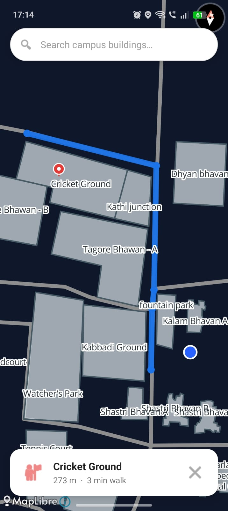

<div align="center">


# 🗺️ MapLibre Offline Navigation

**A fully offline, real-time indoor/campus navigation app for Android.**
Built with MapLibre GL Native and Kotlin — no internet required, no API keys, no cost.

> *Tap a building → get a route → start walking.*

<br/>



</div>

---

## ✨ Features

- 🔵 **Real-time GPS** — position snaps to the nearest walkable path automatically
- 🔴 **Destination pin** — red pin drops on the selected building
- 🔍 **Instant search** — autocomplete finds any location by name
- 👆 **Tap to navigate** — tap any building on the map to get a route
- 📏 **Distance & ETA** — bottom card shows walking distance and time
- 🧭 **Dijkstra pathfinding** — shortest path on a custom road graph
- 📡 **100% offline** — routing and search work without internet
- ❌ **Clear route** — one tap dismisses the route and returns to overview

---

## 🚀 Getting Started

### 1. Clone the repo

```bash
git clone https://github.com/Kingjha13/maplibre-offline-navigation.git
cd maplibre-offline-navigation
```

### 2. Open in Android Studio

File → Open → select the cloned folder

### 3. Add your map data file

> ⚠️ `maptest.geojson` is **not included** — you must create it for your own location.

Place your file at:

```
app/src/main/assets/maptest.geojson
```

See the [GeoJSON Setup](#-geojson-setup) section below.

### 4. Update your location center

In `MapActivity.kt`:

```kotlin
private val CAMPUS_CENTER       = LatLng(YOUR_LAT, YOUR_LNG)
private val CAMPUS_DEFAULT_ZOOM = 18.8
```

### 5. Build and run

---

## 📍 GeoJSON Setup

The app needs one GeoJSON file with two feature types:

| Type | Geometry | Purpose | Required Property |
|---|---|---|---|
| Roads / Paths | `LineString` | Walking graph for routing | — |
| Buildings / Places | `Polygon` | Tappable areas, labels, search | `"Name"` |

### Minimal example

```json
{
  "type": "FeatureCollection",
  "features": [
    {
      "type": "Feature",
      "geometry": {
        "type": "LineString",
        "coordinates": [[73.3630, 22.2885], [73.3635, 22.2888]]
      },
      "properties": { "Name": "Main Road" }
    },
    {
      "type": "Feature",
      "geometry": {
        "type": "Polygon",
        "coordinates": [[
          [73.3632, 22.2886], [73.3634, 22.2886],
          [73.3634, 22.2888], [73.3632, 22.2888],
          [73.3632, 22.2886]
        ]]
      },
      "properties": { "Name": "Library" }
    }
  ]
}
```

### Tools to create your file

| Tool | Level | Notes |
|---|---|---|
| [geojson.io](https://geojson.io) | Beginner | Browser-based, no install, direct export |
| [Google My Maps](https://mymaps.google.com) | Beginner | Draw → export KML → convert at [mapshaper.org](https://mapshaper.org) |
| [Felt.com](https://felt.com) | Beginner | Clean UI, direct GeoJSON export |
| [JOSM](https://josm.openstreetmap.de) | Intermediate | Desktop tool, best for large areas |
| [Overpass Turbo](https://overpass-turbo.eu) | Advanced | Extract existing data from OpenStreetMap |

📖 **Full step-by-step guide with screenshots:** [geoforge.example.com/tutorials](#)

---

## 🎨 Customising the Map Style

The file `app/src/main/assets/style.json` controls how the background map looks.

The key values you may want to change:

```json
"background-color": "#0F172A"
```
Change this to set the map background color. `#0F172A` is dark navy. Use `#F8F9FA` for a light style.

```json
"fill-color": "#E9ECEF"
```
Color of land areas.

```json
"fill-color": "#B3E5FC"
```
Color of water bodies.

```json
"line-color": "#B0BEC5"
```
Color of background road lines (not your campus roads — those are controlled in `MapActivity.kt`).

The font glyphs for labels are loaded from:
```json
"glyphs": "https://demotiles.maplibre.org/font/{fontstack}/{range}.pbf"
```
This requires internet the **first time** labels render. To go fully offline, host your own glyphs or use a bundled font tile set.

---

## ⚙️ Configuration

All tunable values are at the top of `MapActivity.kt`:

```kotlin
private val CAMPUS_CENTER                     = LatLng(22.288, 73.363)
private val CAMPUS_DEFAULT_ZOOM               = 18.8
private val ROUTE_RECALC_DISTANCE_METERS      = 3.0
private val SNAP_TO_CORRIDOR_THRESHOLD_METERS = 25.0
private val BRIDGE_DISTANCE_METERS            = 8.0
```

---

## 🏗️ Tech Stack

| Layer | Technology |
|---|---|
| Language | Kotlin |
| Map Rendering | MapLibre GL Native Android |
| Location | Google Play Services — FusedLocationProviderClient |
| Pathfinding | Dijkstra's Algorithm |
| Map Data | Custom GeoJSON |
| Min SDK | Android 5.0 (API 21) |

---

## 📁 Project Structure

```
app/src/main/
├── assets/
│   ├── style.json           ✅ included
│   └── maptest.geojson      ❌ not included — add your own
├── java/.../
│   └── MapActivity.kt
└── res/
    ├── layout/
    │   └── actiivity_map.xml
    └── drawable/
        ├── search_bar_background.xml
        └── card_background.xml
```


## 📋 Roadmap

- [ ] Floor-by-floor indoor navigation
- [ ] Multiple waypoints
- [ ] Turn-by-turn voice guidance
- [ ] Flutter cross-platform version *(in progress)*
- [ ] QR code scan to set destination

---

## 🤝 Contributing

1. Fork the repository
2. Create your branch: `git checkout -b feature/your-feature`
3. Commit: `git commit -m "Add: your feature"`
4. Push: `git push origin feature/your-feature`
5. Open a Pull Request

---

## 🙏 Acknowledgements

- [MapLibre GL Native](https://github.com/maplibre/maplibre-native)
- [OpenStreetMap](https://www.openstreetmap.org)
- [geojson.io](https://geojson.io)
- [mapshaper.org](https://mapshaper.org)

---

## 📄 License

MIT License — see [LICENSE](LICENSE) for details.

---

<div align="center">

Made with ❤️ by [Kingjha13](https://github.com/Kingjha13)

⭐ Star this repo if it helped you!

</div>
